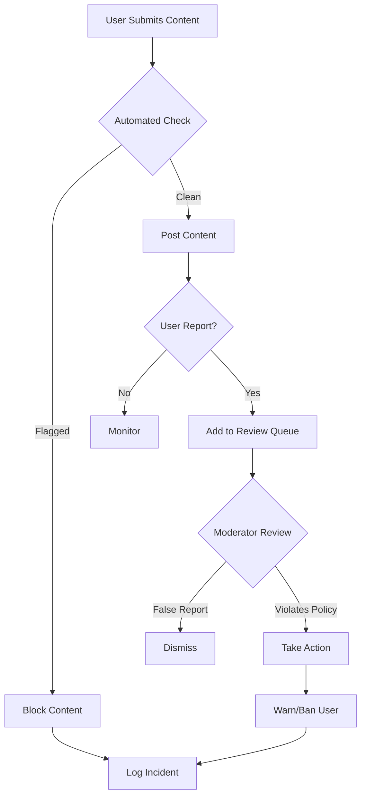

LibreChat provides content moderation capabilities to help maintain a safe and appropriate environment. You can use OpenAI's Moderation API or implement custom moderation logic.

## Overview

Content moderation helps you:
- Filter inappropriate or harmful content
- Comply with content policies
- Protect users from offensive material
- Maintain platform guidelines

<CardGroup cols={2}>
  <Card title="OpenAI Moderation" icon="shield-check" href="#openai-moderation">
    Use OpenAI's built-in moderation API
  </Card>
  <Card title="Custom Moderation" icon="filter" href="#custom-moderation">
    Implement your own moderation rules
  </Card>
  <Card title="User Reports" icon="flag" href="#user-reports">
    Handle user-reported content
  </Card>
  <Card title="Ban Management" icon="user-slash" href="#ban-management">
    Manage banned users and content
  </Card>
</CardGroup>

## OpenAI Moderation

LibreChat can use OpenAI's Moderation API to automatically flag problematic content.

### Configuration

Enable moderation in your `.env` file:

<ParamField path="OPENAI_MODERATION" type="boolean" default="false">
  Enable OpenAI content moderation
</ParamField>

<ParamField path="OPENAI_MODERATION_API_KEY" type="string">
  API key for moderation (uses OPENAI_API_KEY if not set)
</ParamField>

<ParamField path="OPENAI_MODERATION_REVERSE_PROXY" type="string">
  Optional reverse proxy URL for moderation API
</ParamField>

### Example Configuration

```bash .env
OPENAI_MODERATION=true
OPENAI_MODERATION_API_KEY=sk-your-moderation-key
```

### How It Works

<Steps>
  <Step title="User Sends Message">
    User submits a message in a conversation
  </Step>

  <Step title="Moderation Check">
    Message is sent to OpenAI's Moderation API before processing
  </Step>

  <Step title="Flag Detection">
    API checks for:
    - Sexual content
    - Hate speech
    - Harassment
    - Self-harm
    - Violence
    - Illegal activities
  </Step>

  <Step title="Action Taken">
    If flagged:
    - Message is blocked
    - User sees moderation warning
    - Incident is logged
  </Step>
</Steps>

### Moderation Categories

OpenAI's moderation API checks for these categories:

<Accordion title="Sexual Content">
  Content meant to arouse sexual excitement, including:
  - Explicit sexual descriptions
  - Sexual acts
  - Adult content
</Accordion>

<Accordion title="Hate Speech">
  Content that expresses, incites, or promotes hate based on:
  - Race
  - Gender
  - Ethnicity
  - Religion
  - Nationality
  - Sexual orientation
  - Disability
</Accordion>

<Accordion title="Harassment">
  Content that promotes harassment or bullying of individuals or groups.
</Accordion>

<Accordion title="Self-Harm">
  Content that promotes, encourages, or depicts acts of self-harm, including:
  - Suicide
  - Cutting
  - Eating disorders
</Accordion>

<Accordion title="Violence">
  Content that depicts or glorifies violence or celebrates suffering/humiliation.
</Accordion>

<Accordion title="Violence/Graphic">
  Violent content in graphic detail, including gore and death.
</Accordion>

## Custom Moderation

Implement your own moderation logic by extending LibreChat's moderation middleware.

### Custom Moderation Rules

Create custom rules in `api/server/middleware/moderateContent.js`:

```javascript api/server/middleware/moderateContent.js
const customModerationRules = [
  {
    name: 'Profanity Filter',
    pattern: /\b(word1|word2|word3)\b/gi,
    message: 'Your message contains prohibited language',
  },
  {
    name: 'Spam Detection',
    check: (text) => {
      // Detect repeated characters or phrases
      return /([A-Za-z])\1{5,}/.test(text);
    },
    message: 'Your message appears to be spam',
  },
  {
    name: 'URL Restriction',
    pattern: /(https?:\/\/[^\s]+)/gi,
    message: 'URLs are not allowed in messages',
  },
];
```

### Implementing Custom Checks

```javascript
function customModerate(text) {
  for (const rule of customModerationRules) {
    if (rule.pattern && rule.pattern.test(text)) {
      return {
        flagged: true,
        category: rule.name,
        message: rule.message,
      };
    }
    
    if (rule.check && rule.check(text)) {
      return {
        flagged: true,
        category: rule.name,
        message: rule.message,
      };
    }
  }
  
  return { flagged: false };
}
```

## User Reports

Allow users to report inappropriate content for review.

### Report Types

<Tabs>
  <Tab title="Message Reports">
    Users can report individual messages that violate policies:
    - Click report icon on message
    - Select violation category
    - Add optional description
    - Submit report
  </Tab>
  
  <Tab title="User Reports">
    Report problematic users:
    - Report from user profile
    - Select violation type
    - Provide evidence/context
    - Submit to moderators
  </Tab>
  
  <Tab title="Agent Reports">
    Report agents that produce inappropriate content:
    - Report from agent page
    - Describe the issue
    - Include example outputs
  </Tab>
</Tabs>

### Review Queue

Moderators can review reports in the admin dashboard:

1. **View Reports**: See all pending reports
2. **Review Content**: Examine flagged content and context
3. **Take Action**: 
   - Dismiss report
   - Delete content
   - Warn user
   - Ban user
4. **Document Decision**: Add notes about action taken

## Ban Management

Manage users who violate moderation policies.

### Temporary Bans

Set a ban with expiration:

```bash
npm run ban-user user@example.com --duration=7d
```

<Info>
Temporary bans are useful for first-time or minor violations. Users are automatically unbanned after the duration expires.
</Info>

### Permanent Bans

Permanently ban a user:

```bash
npm run ban-user user@example.com
```

### View Banned Users

List all currently banned users:

```bash
npm run list-users --filter=banned
```

### Unban Users

Remove a ban:

```bash
npm run ban-user user@example.com --unban
```

## Moderation Logging

All moderation actions are logged for audit purposes.

### Log Location

Moderation logs are stored in:
- `logs/moderation.log` - All moderation events
- `logs/moderation-errors.log` - Moderation system errors

### Log Format

```json
{
  "timestamp": "2024-03-03T10:30:00Z",
  "userId": "user123",
  "action": "message_blocked",
  "category": "hate",
  "confidence": 0.95,
  "content": "[REDACTED]",
  "moderator": "openai_api"
}
```

## Best Practices

<Steps>
  <Step title="Layer Your Defenses">
    Use both automated moderation (OpenAI API) and custom rules for comprehensive coverage.
  </Step>

  <Step title="Start Conservative">
    Begin with strict moderation and relax rules based on your community's needs and maturity.
  </Step>

  <Step title="Human Review">
    Always have human moderators review edge cases and handle appeals.
  </Step>

  <Step title="Clear Policies">
    Publish clear content policies so users understand what's acceptable.
  </Step>

  <Step title="Consistent Enforcement">
    Apply moderation rules consistently across all users and content.
  </Step>

  <Step title="Regular Review">
    Regularly review moderation logs and adjust rules as needed.
  </Step>
</Steps>

## Moderation Workflow



## Troubleshooting

<Accordion title="Moderation API rate limits exceeded">
  - Use a dedicated moderation API key
  - Implement request queuing
  - Cache moderation results for similar content
  - Consider using a reverse proxy
</Accordion>

<Accordion title="Too many false positives">
  - Adjust moderation thresholds
  - Add whitelisted terms or patterns
  - Review and update custom rules
  - Implement appeal process for users
</Accordion>

<Accordion title="Inappropriate content getting through">
  - Enable stricter moderation levels
  - Add custom rules for specific issues
  - Implement multi-layer moderation
  - Review and update blocked terms list
</Accordion>

<Accordion title="Moderation slowing down responses">
  - Use async moderation for non-critical content
  - Cache moderation results
  - Optimize custom rule checking
  - Consider post-moderation for trusted users
</Accordion>

## Related Documentation

- [User Management](/admin/user-management) - Ban and manage users
- [Configuration](/configuration/environment-variables) - Moderation settings
- [Monitoring](/admin/monitoring) - Track moderation metrics
