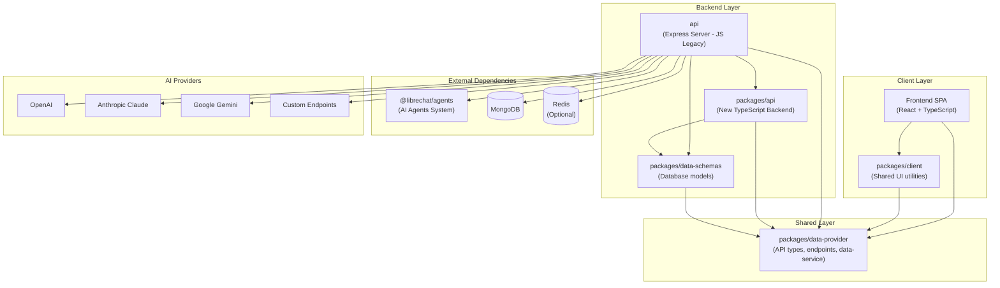
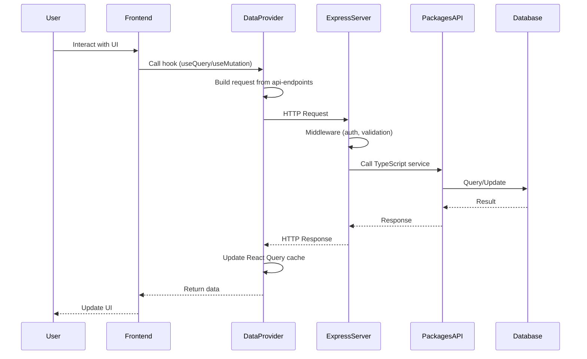
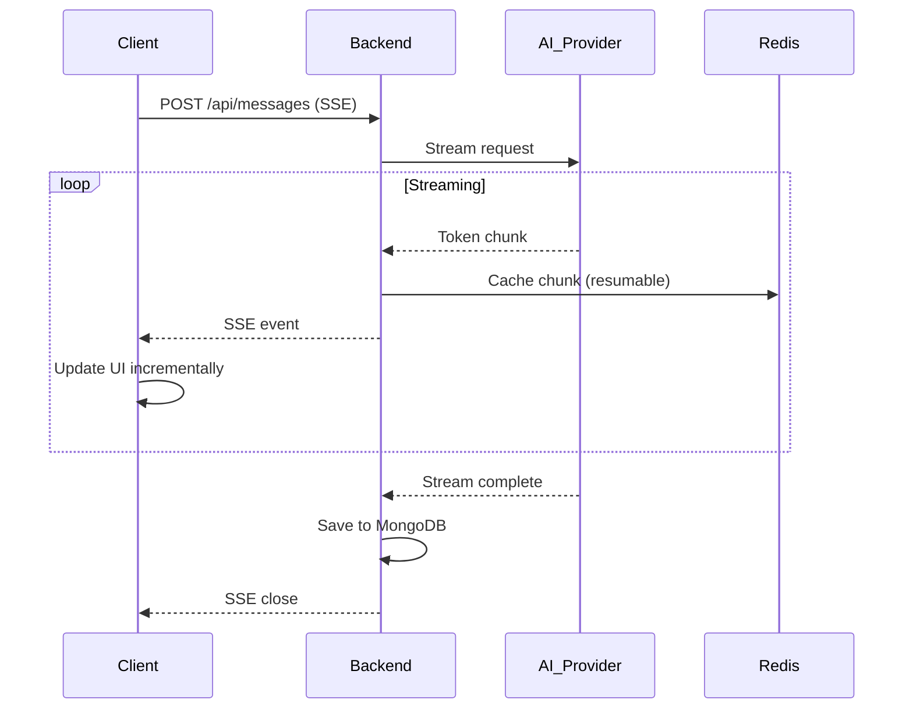

## Overview

LibreChat is a full-stack application built with a modern monorepo architecture. It consists of a Node.js/Express backend, a React frontend, and shared TypeScript packages.



## Architecture Layers

### Frontend Layer

The frontend is a single-page application (SPA) built with React and TypeScript.

<AccordionGroup>
  <Accordion title="Frontend Stack">
    - **Framework**: React 18.2.0
    - **Build Tool**: Vite (with HMR)
    - **Styling**: Tailwind CSS
    - **State Management**: 
      - React Query (@tanstack/react-query) for server state
      - Recoil for client state
      - Jotai for atomic state
    - **Routing**: React Router v6
    - **UI Components**: Radix UI primitives
    - **Form Handling**: React Hook Form
    - **Internationalization**: i18next + react-i18next
  </Accordion>

  <Accordion title="Frontend Architecture">
    **Location**: `/client`

    **Key Directories**:
    - `src/components/` - React components organized by feature
    - `src/data-provider/` - React Query hooks and data fetching
    - `src/hooks/` - Custom React hooks
    - `src/store/` - Global state management (Recoil)
    - `src/routes/` - Application routing
    - `src/locales/` - Translation files (43 languages)
    - `src/utils/` - Utility functions

    **Dev Server**: Runs on `http://localhost:3090/`
  </Accordion>

  <Accordion title="packages/client">
    **Location**: `/packages/client`

    **Purpose**: Shared frontend utilities and components

    - Reusable UI components
    - Theme configuration
    - Common hooks
    - Shared TypeScript types

    **Dependencies**: `packages/data-provider`
  </Accordion>
</AccordionGroup>

### Shared Layer

The shared layer contains code used by both frontend and backend.

<Accordion title="packages/data-provider">
  **Location**: `/packages/data-provider`

  **Purpose**: Central source of truth for API contracts and data structures

  **Contains**:
  - **API Endpoints** (`src/api-endpoints.ts`): URL definitions and endpoint paths
  - **Data Service** (`src/data-service.ts`): HTTP client wrapper for API calls
  - **Types** (`src/types/`): Shared TypeScript interfaces and types
  - **Query Keys** (`src/keys.ts`): React Query cache keys for consistent data management
  - **Mutation Keys** (`src/keys.ts`): React Query mutation identifiers

  **Build Command**: `npm run build:data-provider`

  <Warning>
    This package has no dependencies on other LibreChat packages. It's the foundation of the dependency tree.
  </Warning>
</Accordion>

### Backend Layer

The backend uses a dual architecture: legacy JavaScript code in `/api` with new TypeScript code in `/packages/api`.

<AccordionGroup>
  <Accordion title="api (Legacy Express Server)">
    **Location**: `/api`

    **Language**: JavaScript (legacy)

    **Purpose**: Main Express server - minimize changes here

    **Key Directories**:
    - `server/` - Express server setup and entry point
    - `server/routes/` - API route definitions
    - `server/controllers/` - Request handlers (thin wrappers)
    - `server/middleware/` - Express middleware (auth, validation, etc.)
    - `server/services/` - Business logic (being migrated to packages/api)
    - `models/` - Mongoose model definitions (being migrated)
    - `strategies/` - Passport authentication strategies
    - `db/` - Database connection and utilities

    **Dependencies**: 
    - `packages/api`
    - `packages/data-schemas`
    - `packages/data-provider`
    - `@librechat/agents`

    **Server Port**: `http://localhost:3080/`

    <Note>
      This is a legacy codebase. All new backend code must be TypeScript in `/packages/api`.
    </Note>
  </Accordion>

  <Accordion title="packages/api (New TypeScript Backend)">
    **Location**: `/packages/api`

    **Language**: TypeScript (strict mode)

    **Purpose**: New backend code lives here - all new features must be implemented in TypeScript

    **Architecture**:
    - Model Context Protocol (MCP) services
    - Cache management and Redis integration
    - Stream handling and resumable streams
    - File processing (PDF, DOCX, XLSX, PPTX)
    - Agent orchestration and tool execution
    - Advanced business logic

    **Key Features**:
    - Built with Rollup for optimal bundling
    - Full TypeScript coverage
    - Integration with `@librechat/agents`
    - Peer dependency architecture

    **Dependencies**:
    - `packages/data-schemas`
    - `packages/data-provider`

    <Warning>
      All new backend code must be TypeScript. Never use `any` types. Limit use of `unknown`.
    </Warning>
  </Accordion>

  <Accordion title="packages/data-schemas">
    **Location**: `/packages/data-schemas`

    **Language**: TypeScript

    **Purpose**: Database models and schemas shareable across backend projects

    **Contains**:
    - Mongoose schema definitions
    - Database model types
    - Validation schemas (Zod)
    - Migration utilities

    **Dependencies**: `packages/data-provider`

    **Build Command**: `npm run build:data-schemas`
  </Accordion>
</AccordionGroup>

### External Dependencies

<AccordionGroup>
  <Accordion title="@librechat/agents">
    **Purpose**: Major backend dependency for AI agent orchestration

    **Maintained by**: Same team (separate repository)

    **Source code**: `/home/danny/agentus` (in development environment)

    **Features**:
    - LangChain integration
    - Tool execution framework
    - Agent state management
    - Context protocol support
  </Accordion>

  <Accordion title="MongoDB">
    **Purpose**: Primary database for persistent storage

    **Collections**:
    - Users and authentication
    - Conversations and messages
    - Files and uploads
    - Agents and tools
    - Presets and prompts
    - API keys and tokens

    **Connection Pool Configuration**:
    - `MONGO_MAX_POOL_SIZE`
    - `MONGO_MIN_POOL_SIZE`
    - `MONGO_MAX_CONNECTING`
    - `MONGO_MAX_IDLE_TIME_MS`
  </Accordion>

  <Accordion title="Redis (Optional)">
    **Purpose**: Caching and session management

    **Use Cases**:
    - Session storage
    - Rate limiting
    - Resumable streams (multi-tab/multi-device sync)
    - Cache invalidation

    **Packages Used**:
    - `@keyv/redis`
    - `connect-redis`
    - `rate-limit-redis`
  </Accordion>
</AccordionGroup>

## Data Flow

### Client to Server Request Flow



### Streaming Response Flow

For AI chat responses, LibreChat uses Server-Sent Events (SSE):



<Note>
  LibreChat's resumable streams feature allows responses to automatically reconnect and resume if the connection drops, and works across multiple tabs and devices.
</Note>

## Build System

### Turborepo

LibreChat uses Turborepo for efficient monorepo builds:

```json turbo.json
{
  "tasks": {
    "build": {
      "dependsOn": ["^build"],
      "outputs": ["dist/**"]
    }
  }
}
```

**Benefits**:
- Parallel builds across workspaces
- Intelligent caching (only rebuilds changed packages)
- Dependency-aware execution
- Remote caching support

**Run builds**:
```bash
# Parallel build with Turborepo (recommended)
npm run build

# Sequential build (legacy)
npm run frontend
```

### Build Tools by Package

| Package | Build Tool | Output |
|---------|-----------|--------|
| `client` | Vite | `dist/` (static files) |
| `packages/api` | Rollup | `dist/` (CommonJS + ES modules) |
| `packages/data-provider` | Rollup | `dist/` (CommonJS + ES modules) |
| `packages/data-schemas` | Rollup | `dist/` (CommonJS + types) |
| `packages/client` | Rollup | `dist/` (ES modules) |

## Performance Optimizations

<CardGroup cols={2}>
  <Card title="Frontend">
    - React Query caching and background refetching
    - Cursor pagination for large datasets
    - Code splitting and lazy loading
    - Virtual scrolling (react-virtualized)
    - Image optimization (sharp)
    - PWA support with offline caching
  </Card>

  <Card title="Backend">
    - Connection pooling (MongoDB, Redis)
    - Rate limiting (express-rate-limit)
    - Response compression (gzip)
    - Static file serving optimization
    - Stream processing for large files
    - Horizontal scaling support
  </Card>
</CardGroup>

## Security Architecture

<AccordionGroup>
  <Accordion title="Authentication">
    **Strategies Supported**:
    - Local (username/password with bcrypt)
    - OAuth2 (Google, GitHub, Discord, Facebook, Apple)
    - LDAP
    - SAML 2.0
    - JWT tokens

    **Implementation**: Passport.js with custom strategies in `/api/strategies`
  </Accordion>

  <Accordion title="Authorization">
    - Role-based access control (RBAC)
    - Permission-based access to agents and prompts
    - User and group-based sharing
    - Token-based API authentication
  </Accordion>

  <Accordion title="Security Measures">
    - MongoDB injection prevention (express-mongo-sanitize)
    - Rate limiting per IP/user
    - CORS configuration
    - Helmet.js security headers
    - Session management (express-session)
    - Proxy trust configuration
    - Input validation (Zod schemas)
  </Accordion>
</AccordionGroup>

## Next Steps

<CardGroup cols={2}>
  <Card title="Monorepo Guide" icon="folder-tree" href="/development/monorepo">
    Explore the workspace structure and dependency relationships
  </Card>
  <Card title="Frontend Development" icon="react" href="/development/frontend/components">
    Learn about React components and state management
  </Card>
  <Card title="Backend Development" icon="server" href="/development/backend/routes">
    Understand backend routes and API patterns
  </Card>
  <Card title="Testing" icon="flask" href="/development/testing">
    Write tests for LibreChat components
  </Card>
</CardGroup>
