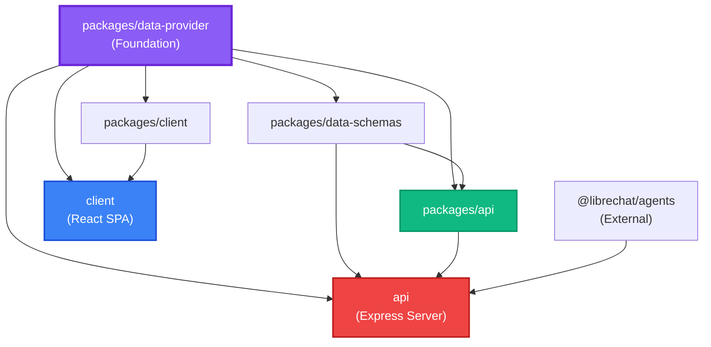

## Overview

LibreChat uses npm workspaces to manage its monorepo structure. The project is organized into multiple packages with clear boundaries and dependencies.

```bash
LibreChat/
├── api/                    # Legacy Express server (JavaScript)
├── client/                 # Frontend SPA (React + TypeScript)
├── packages/
│   ├── api/               # New backend code (TypeScript only)
│   ├── client/            # Shared frontend utilities
│   ├── data-provider/     # Shared API contracts
│   └── data-schemas/      # Database models
├── config/                # Configuration scripts
├── e2e/                   # Playwright E2E tests
├── package.json           # Root package with workspaces
└── turbo.json            # Turborepo configuration
```

## Workspace Configuration

The root `package.json` defines the workspace structure:

```json package.json
{
  "name": "LibreChat",
  "version": "v0.8.3-rc1",
  "packageManager": "npm@11.10.0",
  "workspaces": [
    "api",
    "client",
    "packages/*"
  ]
}
```

This configuration allows:
- Shared dependency management across all packages
- Hoisted dependencies to the root `node_modules`
- Local package linking without publishing
- Unified scripts and tooling

## Workspaces

### Backend Workspaces

<Tabs>
  <Tab title="api (Legacy)">
    **Location**: `/api`

    **Package Name**: `@librechat/backend`

    **Language**: JavaScript (legacy)

    **Purpose**: Express server - minimize changes here

    **Dependencies**:
    ```json
    {
      "@librechat/api": "*",
      "@librechat/data-schemas": "*",
      "librechat-data-provider": "*",
      "@librechat/agents": "^3.1.54"
    }
    ```

    **Key Files**:
    - `server/index.js` - Main entry point
    - `server/routes/` - API route definitions
    - `server/controllers/` - Request handlers
    - `server/middleware/` - Express middleware
    - `server/services/` - Business logic (migrating out)
    - `models/` - Mongoose models (migrating out)

    **Development**:
    ```bash
    npm run backend:dev  # Start with nodemon
    ```

    <Warning>
      This is legacy code. All new backend features must be implemented in TypeScript in `/packages/api`.
    </Warning>
  </Tab>

  <Tab title="packages/api">
    **Location**: `/packages/api`

    **Package Name**: `@librechat/api`

    **Language**: TypeScript (strict mode)

    **Purpose**: All new backend code lives here

    **Dependencies**:
    ```json
    {
      "@librechat/data-schemas": "*",
      "librechat-data-provider": "*"
    }
    ```

    **Peer Dependencies**: Major libraries like `@librechat/agents`, `mongoose`, `express`, etc.

    **Build Configuration**:
    - **Tool**: Rollup
    - **Output**: CommonJS + ES modules
    - **Entry**: `src/index.ts`
    - **Types**: `dist/types/index.d.ts`

    **Key Features**:
    - MCP (Model Context Protocol) services
    - Cache management
    - Stream handling
    - File processing
    - Agent orchestration

    **Build**:
    ```bash
    npm run build:api
    cd packages/api && npm run build
    ```

    <Note>
      This package is consumed by `/api` as a dependency. The legacy server calls into these TypeScript modules.
    </Note>
  </Tab>

  <Tab title="packages/data-schemas">
    **Location**: `/packages/data-schemas`

    **Package Name**: `@librechat/data-schemas`

    **Language**: TypeScript

    **Purpose**: Database models and schemas shareable across backend projects

    **Dependencies**:
    ```json
    {
      "librechat-data-provider": "*"
    }
    ```

    **Contains**:
    - Mongoose schema definitions
    - Database model types
    - Zod validation schemas
    - Migration utilities

    **Example Structure**:
    ```typescript
    src/
    ├── schemas/
    │   ├── user.ts
    │   ├── conversation.ts
    │   ├── message.ts
    │   └── agent.ts
    ├── models/
    └── index.ts
    ```

    **Build**:
    ```bash
    npm run build:data-schemas
    ```
  </Tab>
</Tabs>

### Frontend Workspaces

<Tabs>
  <Tab title="client">
    **Location**: `/client`

    **Package Name**: `@librechat/frontend`

    **Language**: TypeScript + React

    **Purpose**: Main frontend SPA

    **Dependencies**:
    ```json
    {
      "@librechat/client": "*",
      "librechat-data-provider": "*",
      "react": "^18.2.0",
      "@tanstack/react-query": "^4.28.0"
    }
    ```

    **Structure**:
    ```bash
    src/
    ├── components/       # React components by feature
    ├── data-provider/    # React Query hooks
    ├── hooks/           # Custom React hooks
    ├── routes/          # React Router routes
    ├── store/           # Recoil state atoms
    ├── locales/         # i18n translations (43 languages)
    ├── utils/           # Utility functions
    ├── App.jsx          # Root component
    └── main.jsx         # Entry point
    ```

    **Build**:
    ```bash
    npm run build:client
    cd client && npm run build
    ```

    **Development**:
    ```bash
    npm run frontend:dev  # Vite dev server on :3090
    ```

    **Build Output**:
    - Static files in `dist/`
    - Served by Express in production
    - HMR in development via Vite
  </Tab>

  <Tab title="packages/client">
    **Location**: `/packages/client`

    **Package Name**: `@librechat/client`

    **Language**: TypeScript

    **Purpose**: Shared frontend utilities and components

    **Dependencies**:
    ```json
    {
      "librechat-data-provider": "*"
    }
    ```

    **Contains**:
    - Reusable UI components
    - Theme configuration
    - Common hooks
    - Shared TypeScript types
    - Utility functions

    **Example Exports**:
    ```typescript
    // Shared types
    export * from './types';
    
    // Common hooks
    export { useTheme } from './hooks';
    
    // Utility functions
    export * from './utils';
    ```

    **Build**:
    ```bash
    npm run build:client-package
    ```
  </Tab>
</Tabs>

### Shared Workspace

<Accordion title="packages/data-provider - The Foundation">
  **Location**: `/packages/data-provider`

  **Package Name**: `librechat-data-provider`

  **Language**: TypeScript

  **Purpose**: Shared API types, endpoints, and data service used by both frontend and backend

  **Dependencies**: None (foundation of dependency tree)

  **Structure**:
  ```bash
  src/
  ├── api-endpoints.ts    # API endpoint URLs
  ├── data-service.ts     # HTTP client wrapper
  ├── keys.ts             # React Query keys
  ├── types/
  │   ├── queries.ts      # API request/response types
  │   ├── models.ts       # Domain model types
  │   └── index.ts
  └── index.ts
  ```

  **Usage Example**:
  ```typescript
  // In frontend
  import { getConversations } from 'librechat-data-provider';
  import { QueryKeys } from 'librechat-data-provider';

  // In backend
  import type { Conversation } from 'librechat-data-provider';
  ```

  **Build**:
  ```bash
  npm run build:data-provider
  cd packages/data-provider && npm run build
  ```

  <Warning>
    After making changes to `data-provider`, you must rebuild it and restart both frontend and backend servers.
  </Warning>
</Accordion>

## Dependency Graph



**Key Points**:
- `data-provider` has no internal dependencies (foundation)
- All packages depend on `data-provider`
- `/api` (Express server) consumes `/packages/api` (TypeScript backend)
- Frontend packages are independent of backend packages (except `data-provider`)

## Workspace Boundaries

<Warning>
  **Critical Rules**: Follow these boundaries to maintain clean architecture
</Warning>

### Backend Rules

1. **All new backend code must be TypeScript** in `/packages/api`
2. Keep `/api` changes to the absolute minimum (thin JS wrappers calling into `/packages/api`)
3. Database-specific shared logic goes in `/packages/data-schemas`
4. Frontend/backend shared API logic (endpoints, types, data-service) goes in `/packages/data-provider`

### Frontend Rules

1. All user-facing text must use `useLocalize()`
2. Only update English keys in `client/src/locales/en/translation.json`
3. Feature hooks go in: `client/src/data-provider/[Feature]/queries.ts` → `[Feature]/index.ts` → `client/src/data-provider/index.ts`
4. React Query (`@tanstack/react-query`) for all API interactions
5. QueryKeys and MutationKeys defined in `packages/data-provider/src/keys.ts`

### Data Provider Integration

**Endpoints**: `packages/data-provider/src/api-endpoints.ts`

```typescript
export const endpoints = {
  conversations: '/api/conversations',
  messages: '/api/messages',
  agents: '/api/agents',
};
```

**Data Service**: `packages/data-provider/src/data-service.ts`

```typescript
export const dataService = {
  get: (url: string) => fetch(url).then(r => r.json()),
  post: (url: string, data: unknown) => fetch(url, { 
    method: 'POST', 
    body: JSON.stringify(data) 
  }),
};
```

**Types**: `packages/data-provider/src/types/queries.ts`

```typescript
export interface ConversationListResponse {
  conversations: Conversation[];
  pageNumber: number;
  pageSize: number;
}
```

## Development Workflow

### Workflow for Backend Changes

<Steps>
  <Step title="Write TypeScript code">
    Add new features in `/packages/api` (TypeScript only):

    ```typescript
    // packages/api/src/services/agent-service.ts
    export async function createAgent(data: AgentInput) {
      // Implementation
    }
    ```
  </Step>

  <Step title="Build the package">
    ```bash
    npm run build:api
    ```
  </Step>

  <Step title="Create thin wrapper in /api">
    Add minimal JavaScript wrapper in `/api`:

    ```javascript
    // api/server/controllers/agents.js
    const { createAgent } = require('@librechat/api');

    async function createAgentController(req, res) {
      const result = await createAgent(req.body);
      res.json(result);
    }
    ```
  </Step>

  <Step title="Restart backend">
    ```bash
    npm run backend:dev
    ```
  </Step>
</Steps>

### Workflow for Data Provider Changes

<Steps>
  <Step title="Update data-provider">
    Modify types, endpoints, or data service:

    ```typescript
    // packages/data-provider/src/types/queries.ts
    export interface NewFeatureRequest {
      name: string;
      config: Record<string, unknown>;
    }
    ```
  </Step>

  <Step title="Rebuild data-provider">
    ```bash
    npm run build:data-provider
    ```

    <Warning>
      This is critical! Both frontend and backend depend on this package.
    </Warning>
  </Step>

  <Step title="Update consumers">
    Update code in `/api`, `/packages/api`, or `/client` to use new types:

    ```typescript
    // client/src/data-provider/Feature/queries.ts
    import type { NewFeatureRequest } from 'librechat-data-provider';
    ```
  </Step>

  <Step title="Restart servers">
    ```bash
    # Terminal 1: Restart backend
    npm run backend:dev

    # Terminal 2: Restart frontend  
    npm run frontend:dev
    ```
  </Step>
</Steps>

### Workflow for Frontend Changes

<Steps>
  <Step title="Add components and hooks">
    Create components in `/client/src/components/`:

    ```tsx
    // client/src/components/Features/NewFeature.tsx
    export function NewFeature() {
      const localize = useLocalize();
      return <div>{localize('com_ui_new_feature')}</div>;
    }
    ```
  </Step>

  <Step title="Add translations">
    Update only English translations:

    ```json
    // client/src/locales/en/translation.json
    {
      "com_ui_new_feature": "New Feature"
    }
    ```
  </Step>

  <Step title="Create data hooks">
    Add React Query hooks:

    ```typescript
    // client/src/data-provider/NewFeature/queries.ts
    export function useNewFeature() {
      return useQuery(
        QueryKeys.newFeature,
        () => dataService.get('/api/new-feature')
      );
    }
    ```
  </Step>

  <Step title="Hot reload">
    Vite will automatically reload. No restart needed!
  </Step>
</Steps>

## Build Commands Reference

### Root-Level Build Commands

```bash
# Build everything with Turborepo (parallel, cached)
npm run build

# Build all packages sequentially (legacy)
npm run frontend

# Build individual packages
npm run build:data-provider
npm run build:data-schemas
npm run build:api
npm run build:client-package
npm run build:client

# Build all packages (no client)
npm run build:packages
```

### Workspace-Specific Builds

```bash
# Build from within a workspace
cd packages/api && npm run build
cd packages/data-provider && npm run build
cd client && npm run build
```

### Turborepo Benefits

<CardGroup cols={2}>
  <Card title="Parallel Execution">
    Builds multiple packages simultaneously when dependencies allow
  </Card>
  <Card title="Smart Caching">
    Only rebuilds packages that have changed since last build
  </Card>
  <Card title="Dependency Awareness">
    Automatically builds dependencies in correct order
  </Card>
  <Card title="Remote Caching">
    Can share build cache across team and CI/CD
  </Card>
</CardGroup>

## Package Scripts

### Shared Scripts (Root)

The root `package.json` provides scripts that work across all workspaces:

```json
{
  "scripts": {
    "smart-reinstall": "node config/smart-reinstall.js",
    "reinstall": "node config/update.js -l -g",
    "backend": "cross-env NODE_ENV=production node api/server/index.js",
    "backend:dev": "cross-env NODE_ENV=development npx nodemon api/server/index.js",
    "frontend:dev": "cd client && npm run dev",
    "build": "npx turbo run build",
    "test:all": "npm run test:client && npm run test:api && npm run test:packages:api",
    "lint": "eslint \"{,!(node_modules|venv)/**/}*.{js,jsx,ts,tsx}\"",
    "lint:fix": "eslint --fix \"{,!(node_modules|venv)/**/}*.{js,jsx,ts,tsx}\"",
    "format": "npx prettier --write \"{,!(node_modules|venv)/**/}*.{js,jsx,ts,tsx}\""
  }
}
```

## Testing Strategy

### Per-Workspace Testing

Tests are run from their respective workspace directories:

```bash
# Run tests in a specific workspace
cd api && npx jest <pattern>
cd packages/api && npx jest <pattern>
cd client && npm run test
```

### Root-Level Test Commands

```bash
# Run all tests
npm run test:all

# Run specific workspace tests
npm run test:client
npm run test:api
npm run test:packages:api
npm run test:packages:data-provider
npm run test:packages:data-schemas
```

### Frontend Tests

- Located in `__tests__` directories alongside components
- Use `test/layout-test-utils` for rendering
- Cover loading, success, and error states
- Mock data-provider hooks and external dependencies

### Backend Tests

- Framework: Jest
- Integration tests with MongoDB Memory Server
- Unit tests for services and utilities
- Mock external API calls

## External Dependencies

### @librechat/agents

**Source**: External repository (`/home/danny/agentus` in dev environment)

**Version**: `^3.1.54`

**Purpose**: AI agent orchestration and tool execution

**Used by**: `/api` and `/packages/api`

**Features**:
- LangChain integration
- Custom tool definitions
- Agent state management
- Context protocol support

<Note>
  This is maintained by the same team but lives in a separate repository. It's consumed as an npm dependency.
</Note>

## Common Patterns

### Importing from Workspaces

```typescript
// Import from data-provider (works in any workspace)
import { QueryKeys } from 'librechat-data-provider';
import type { Conversation } from 'librechat-data-provider';

// Import from packages/api (only in /api)
const { createAgent } = require('@librechat/api');

// Import from packages/client (only in /client)
import { useTheme } from '@librechat/client';

// Import from packages/data-schemas (in backend only)
import { UserSchema } from '@librechat/data-schemas';
```

### Module Resolution

Workspace packages are linked locally during development:

```json
// In client/package.json
{
  "dependencies": {
    "librechat-data-provider": "*"  // Links to packages/data-provider
  }
}
```

The `*` version means "use the local workspace version".

## Next Steps

<CardGroup cols={2}>
  <Card title="Setup Guide" icon="rocket" href="/development/setup">
    Get your development environment running
  </Card>
  <Card title="Architecture" icon="sitemap" href="/development/architecture">
    Understand how components interact
  </Card>
  <Card title="Code Style" icon="code" href="/development/code-style">
    Follow LibreChat coding standards
  </Card>
  <Card title="Frontend Guide" icon="react" href="/development/frontend/components">
    Build React components
  </Card>
</CardGroup>
